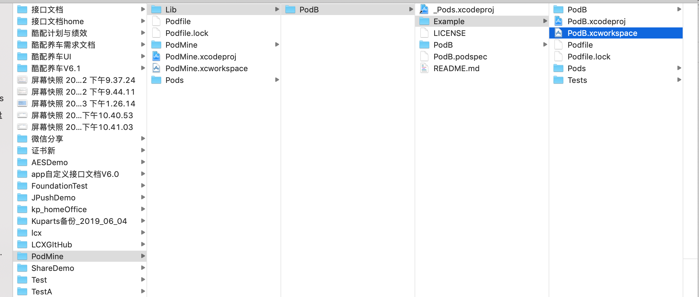
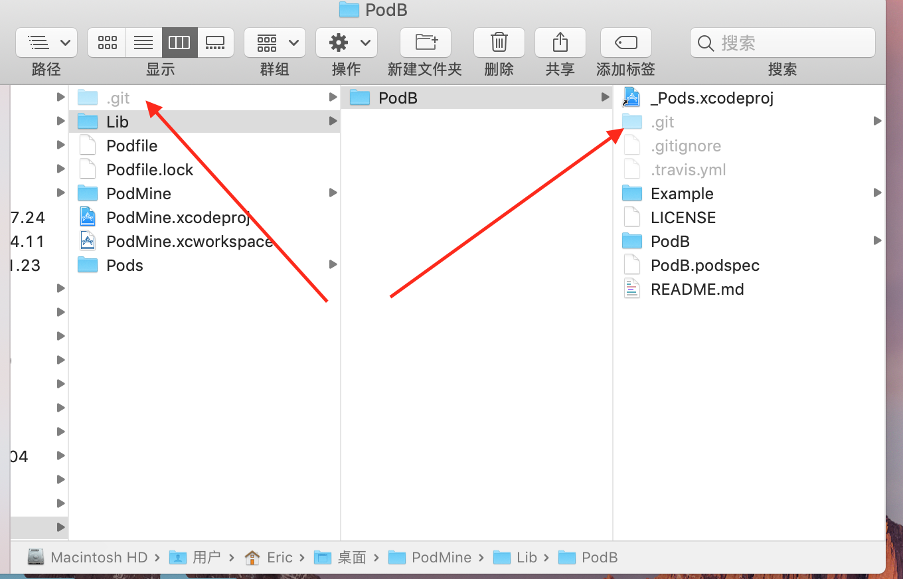
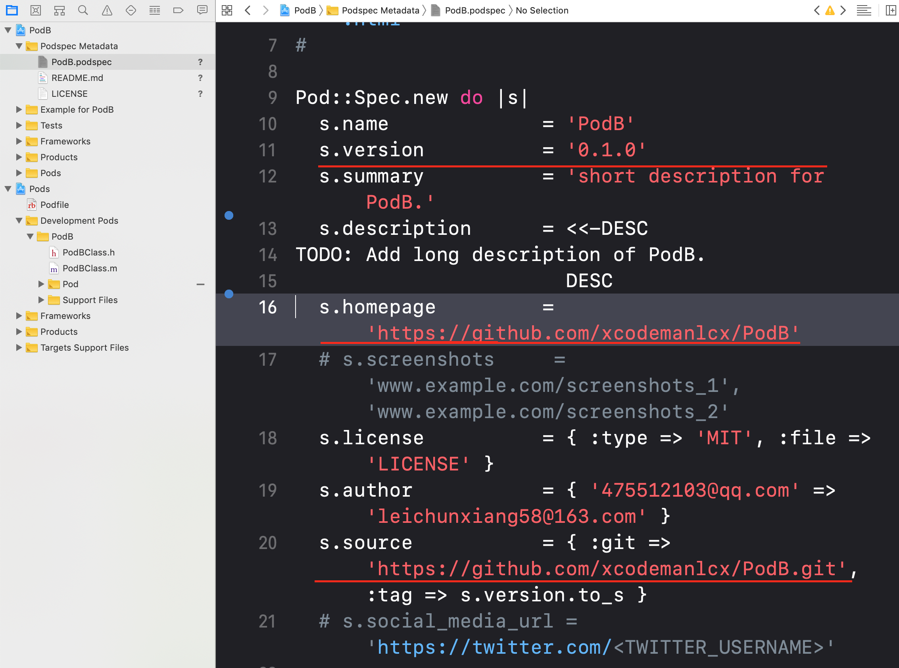

[TOC]
### 前言：知识点与资料准备
* git：本地仓库git关联远程remote命令；
* cocoapods：最新版本与gem源；
* 制作后参考图；
* 参考网址；

####  一 制作后参考图：Cocoapods工程（PodMine）与Pod组件工程(PodB)目录图，与.git图

* 目录图

* .git文件图(shit+cammand+.可切换隐藏文件显示与隐藏）

* PodB.podspec图

####  二 Cocoapods组件制作与验证
#####  1 创建Cocoapods壳工程（PodMine)
* **xcode新建工程PodMine**
* **pod init**
//创建Podfile
* **cd 工程目录**
* **pod install**
//创建工程的.xcworkspace相关文件

#####  2 创建pod组件工程（PodB，在PodMine目录下）
* **PodMine工程目录建文件Lib**
* **cd Lib目录**
* **pod lib create PodB**
//创建PodB组件工程
* **根据提示选择平台和语言等**

#####  3 创建Pod组件的类文件 
* 1 打开组件工程工作区Example.xcworkspace；
* 2 添加自己的类文件，与ReplaceMe.m文件同目录（show in find可查看ReplaceMe.m文件的目录）；
* 3 删除ReplaceMe.m文件和其引用；
* 4 cd Example目录
* 5 pod install

##### 4 壳工程（PodMine）使用本地pod组件
* Podfile添加PodB组件： pod 'PodB', :path => 'Lib/PodB'
* **pod install**

##### 5 git关联远程PodMine（github的同名新工程）
* github新建repository仓库（与本地PodMine工程同名），无需ReadMe.md;
* **cd PodMine壳工程目录**
* **git init**
//无git，则需要次命令；
* **git add .**
// 会发现警告warning: adding embedded git repository:
* **git commit -m 'init project'**
//init project：表示说明内容
* **git remote add origin origin https://github.com/xcodemanlcx/PodMine.git**
//https://github.com/xcodemanlcx/PodMine.git:表示远程地址；
* **git push origin master -f**
// -f：表示强制性，首次提交可忽略提示；
* 刷新远程仓库
//github 对应仓库https://github.com/xcodemanlcx/PodMine刷新，检查提交结果

##### 6 git关联远程PodB组件工程，且tag标记组件版本
* 1 与git关联远程PodMine工程，同理
* 2 **git tag 0.1.0**
* 3 **git push --tags**

##### 7 .podspec文件修改、验证、提交、搜索
* 编辑.podspec文件
1 s.version与git的tag一致；
2 s.homepage：https://github.com/xcodemanlcx/PodB；
3 s.source：https://github.com/xcodemanlcx/PodB.git；

* **pod lib lint --verbose**
//验证.podspec是否通过；出现passed validation，说明通过；

* **cd Lib/PodB**

* pod trunk register xxx@xxx.com 'lcx' --description='mac 15'
//说明：邮箱注册验证，已注册则忽略
1.xxx@xxx.com:表示邮箱地址；
2.lcx:表示名称；
3.mac 15：表示描述内容；

* **pod trunk me**
//查看验证信息

* **pod trunk push LCXPodB.podspec --verbose**
//trunk 推送，--verbose:表示详情打印；
**说明：因为PodB有人已提交过，所以后来项目组件改名为LCXPodB；**

* **pod search LCXPodB**
//搜索库

* 搜索不到库
**rm ~/Library/Caches/CocoaPods/search_index.json**或者**pod repo update**
#### 三 遇到问题
* 问题：执行pod trunk push PodB.podspec的问题：
终端命令描述**Failed to connect to GitHub to update the CocoaPods/Specs specs repo - Please check if you are offline, or that GitHub is down**;

* 解决方法：cocoapods升级
**sudo gem install cocoapods**;

#### 四 总结：为什么那么多时间？整理流程？
* **解决问题**
1.cocoapods未升级最新版本；
* **问题反思**
1.由提示（不能更新update或者很久不能更新成功），可考虑升级cocoapods；
* **影响效率** 
1.未分步累积demo；
2.未坚持去解决；
3.进入翻墙误区；
* **功能偏多**
1.本地工程关联remote的git命令；
2.测试pod组建的壳工程；

#### 附一：CocoaPods相关命令
* sudo gem install cocoapods
升级
* pod --version
* gem source -l
//查看gem源

#### 附二 制作参考网址
* [主要参考](https://www.jianshu.com/p/c91f8214ecc8)
* [辅助参考](https://www.jianshu.com/p/c94d394f0be7)